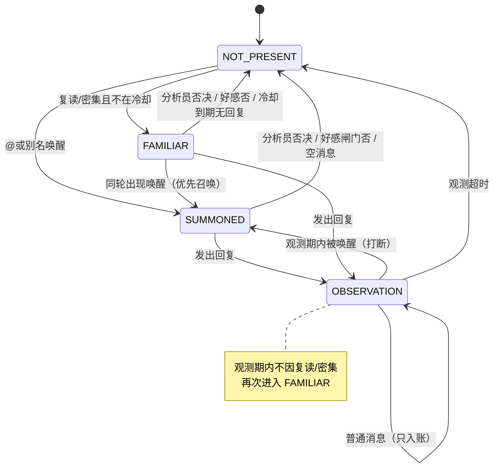

# Phase 1 · 状态机设计

> 对标 Angel Heart 四状态，落到 FakeAi `interaction/state_machine`。  
> **本文件为设计定稿草案**；实现前须用户确认交互预览（见 `interaction-preview.md`）。

---

## 1. 状态定义

| 状态 ID | 显示名 | 含义 | 是否调用分析员 |
|---------|--------|------|----------------|
| `NOT_PRESENT` | 不在场 | 静默观察；消息仍入账 | 否（除非本轮检测升级） |
| `SUMMONED` | 被呼唤 | `@` 机器人或消息含唤醒别名 | **是**（倾向回复） |
| `FAMILIAR` | 混脸熟 | 复读或密集讨论达标 | **是**（偏严，默认可否） |
| `OBSERVATION` | 观测中 | 刚回复过，避免抢话 | 仅 **SUMMONED 打断** 时再分析 |

命名备注：Heart 用 `GETTING_FAMILIAR`，本地缩写为 `FAMILIAR`。

---

## 2. 状态图



---

## 3. 判定优先级（`determine`）

对每个群会话，按序检查（高优先先命中即返回）：

1. **闭嘴 / 群不在白名单 / 排除插件命令 / 冻结用户非查询** → 保持或视为不可交互（命令分流见 `trigger-compat.md`）
2. **SUMMONED**：上次 AI 回复之后出现过 `@` 自己，**或** 最新用户消息含别名（默认含「蓝晴」）
3. **若当前已是 OBSERVATION 且未超时** → 留在 OBSERVATION（除非上一步已判 SUMMONED）
4. **FAMILIAR**（仅当当前为 `NOT_PRESENT`，且不在混脸熟冷却）：
   - 复读：时间窗内相同纯文本出现次数 ≥ `echo_threshold`
   - 或密集：时间窗内消息数 ≥ `dense_threshold` 且参与人数 ≥ `min_participants`
5. 否则 **NOT_PRESENT**

> 与 Heart 对齐：混脸熟异常滞留在判定里时强制降为 `NOT_PRESENT`。

---

## 4. 转换表

| 当前 | 事件 | 下一状态 | 副作用 |
|------|------|----------|--------|
| * | 入账消息 | （不变，先写入 context） | ReplyCache / buffer 追加 |
| `NOT_PRESENT` | 唤醒 | `SUMMONED` | 调分析员 |
| `NOT_PRESENT` | 复读/密集 OK | `FAMILIAR` | 调分析员 |
| `SUMMONED`/`FAMILIAR` | `should_reply`+好感过 | `OBSERVATION` | 发消息；启动观测计时；可选开启混脸熟冷却 |
| `SUMMONED`/`FAMILIAR` | 否决 | `NOT_PRESENT` | 无回复；FAMILIAR 否决时可记短冷却 |
| `OBSERVATION` | 超时 | `NOT_PRESENT` | 清观测标记 |
| `OBSERVATION` | 唤醒 | `SUMMONED` | 打断观测；调分析员 |
| `OBSERVATION` | 复读/密集 | `OBSERVATION` | **忽略**，只入账 |
| 任意 | 群 CD 未到（硬下限） | （阻止发送） | 分析可通过但不发，或直接跳过分析（实现时二选一，建议：**CD 内跳过专家调用**） |

---

## 5. 建议默认参数（可配）

| 键 | 建议默认 | 说明 |
|----|----------|------|
| `observation_sec` | `45` | 回复后观测时长（替换「纯靠 10s CD」的体感主体） |
| `group_cd_sec` | `10` | 保留为发送硬下限，防连发 |
| `familiar_cooldown_sec` | `120` | 一次混脸熟回复后，多久内不再因热闹触发 |
| `echo_window_sec` | `30` | 复读统计窗 |
| `echo_threshold` | `3` | 同文出现次数 |
| `dense_window_sec` | `20` | 密集窗 |
| `dense_threshold` | `8` | 窗内消息条数 |
| `min_participants` | `3` | 密集最少人数 |
| `aliases` | `["蓝晴"]` | 可配置多别名 |

---

## 6. 与好感度、CD 的关系

```text
determine() → 状态
    →（SUMMONED / FAMILIAR）analyst.decide()
        → should_reply?
            → favorability 闸门（概率/黑名单档）
                → group_cd 硬下限
                    → 专家生成 → OBSERVATION
```

- 好感度 **不替代** 状态机，只做「回了之后热不热情 / 允不允许回」的第二闸。
- 低好感：分析员说回，闸门仍可否；高好感不自动制造 FAMILIAR。

---

## 7. 实现边界（Phase 1 代码未开始）

- 状态按 **`group_id`** 存放（每群独立）。
- 不做 Heart 级门锁/事件扣押；沿用 `try_acquire_group_cd`。
- 私聊不进入本状态机（推迟）。
